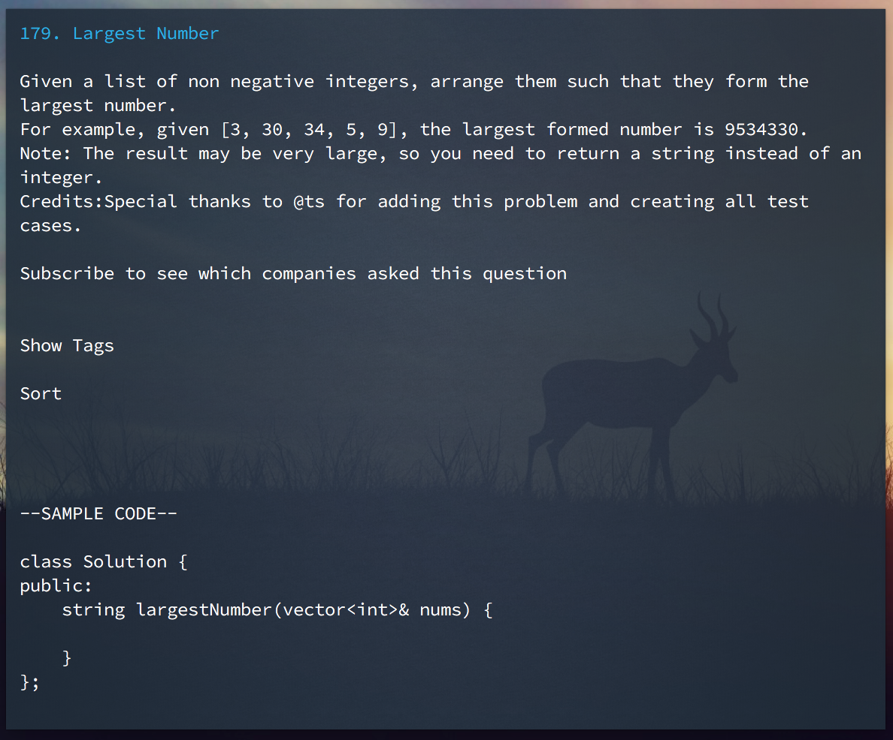

============================
Terminal-Leetcode
============================
Terminal-Leetcode is a terminal based leetcode website viewer.  
This project is inspired by [RTV](https://github.com/michael-lazar/rtv).


<!---->
---------------

[](https://travis-ci.org/chishui/terminal-leetcode)
[](https://pypi.python.org/pypi/terminal-leetcode)
[](https://pypi.python.org/pypi/terminal-leetcode)

---------------
# Requirements
- Python 2.7  
- [Urwid](https://github.com/urwid/urwid)

# Installation
Install with pip  
```
 $ pip install terminal-leetcode
```
Clone the repository  
```
 $ git clone https://github.com/chishui/terminal-leetcode.git  
 $ cd terminal-leetcode  
 $ sudo python setup.py install  
```
# Usage
To run the program, input ``leetcode`` in terminal    
```
 $ leetcode
```
### Login
To login you need to create a config.cfg file in folder ~/.config/leetcode.  
Input your username and password in config.cfg as:  
```
[leetcode]
username=chishui
password=123456
```
Then restart this program.
### Programming Language
You can set your programming language in config.cfg as:
```
[leetcode]
........
language=Java
```
to see default sample code in quiz detail view in your favorite language.  
Please make sure to use Leetcode supported programming languages and use the string exactly 
the same as it appears in Leetcode.    

### Tags
You can customize your "Tag" column by adding a json file named tag.json into ~/.config/leetcode folder.  
The format of tag.json is showed below:  
```
{
  "1" : ["F", "G"],
  "10" : ["F"],
  ......
}
```
By adding this file, quiz 1 will have a "F" and "G" tag and quiz 10 will have a "F" tag.  
You can use this feature to add company tag on quizzes.  
I have added a "F" tag sample file in "tags" folder. You could try this file to see all "F" tag quizzes.  
### Writing Code
Terminal-Leetcode allows you to open editor to edit default code you are viewing.  
You can set your code editing settings in config.cfg as:
```
[leetcode]
........
ext=java # file extention
path=~/program/leetcode # code file directory
```
Then when you are in quiz detail view, press ``e`` to open editor to edit code sample.  
Code sample is saved into directory you set in config.cfg automatically with file name combined
with quiz id and file extension you set.  
Default editor is vim, you can set ``export EDITOR=***`` to change editor. You can refer to
[this article](http://sweetme.at/2013/09/03/how-to-open-a-file-in-sublime-text-2-or-3-from-the-command-line-on-mac-osx/)
to use Sublime Text as command line editor.
#### Tmux Support
If you're using Terminal-Leetcode inside of a tmux session, when you press ``e``, current tmux window will be
splitted vertically and an editor is opened inside the new created tmux pane.
This feature could be turned on and off by config option in config.cfg as:  
```
[leetcode]
........
tmux_support=true/false
```
#### Code Snippet
Two code snippets can be used when creating code file.  
You can create files ``before`` and ``after`` in ``~/.config/leetcode/snippet``. Code snippet in ``before``
will be placed at the beginning of the code file. Code snippet in file ``after`` will be placed at the end of
the code file.  
Like in C++, write
```
#include <iostream>
#include <vector>

using namespace std;
```
in file ``before`` and
```
int main() {
    Solution s;
}
```
in file ``after``, then you can view code of quiz (take quiz 123 for example) as:
```
#include <iostream>
#include <vector>

using namespace std;

class Solution {
public:
    int maxProfit(vector<int>& prices) {
        
    }
};

int main() {
    Solution s;
}
```
It becomes much easier to write your solution code and then test your solution.  
#### C++ Specific
- If you don't set language in config.cfg, default language is C++.  
- If you set C++ as your programming language, when you open editor, a Makefile is created automatically, so
after you finish the code, you can use ``make`` directly to compile your code. 


# Controls:
- Press ``H`` to see help information.  
- Press ``up`` and ``down`` to go through quiz list.  
- Press ``enter`` or ``right`` to see a quiz detail, and press ``left`` to go back.  
- Press ``R`` in quiz list view to retrieve quiz from website.  
- Press ``PageUp`` or ``PageDown`` to go to prev or next page.  
- Press ``Home`` or ``End`` to go to the first or last quiz.
- Press ``f`` in quiz list view to search quiz by id or title.
- Press ``n`` in quiz list view to search next quiz with search text input before.  
In quiz detail view, press ``n`` will always create a new sample code file.
- Press ``t`` in quiz list view to add tag for quiz.
- Press ``e`` in quiz detail view to open editor to edit code.
- Press ``d`` in quiz detail view to open discussion page in web browser.
- Press ``1`` in quiz list view to sort quiz list by id.
- Press ``2`` in quiz list view to sort quiz list by title.
- Press ``3`` in quiz list view to sort quiz list by acceptance.
- Press ``4`` in quiz list view to sort quiz list by difficulty.  
Vim's moving keys ``h``, ``j``, ``k``, ``l``, ``ctrl+f``, ``ctrl+b`` are supported.

# TODO
- Test
- Submit code
- ~~User login~~
- ~~Quiz list sort~~
- ~~Install with pip~~
- ~~Get quiz default code interface~~

# Contribute
All kinds of contributions are welcome.

# Licence
MIT

